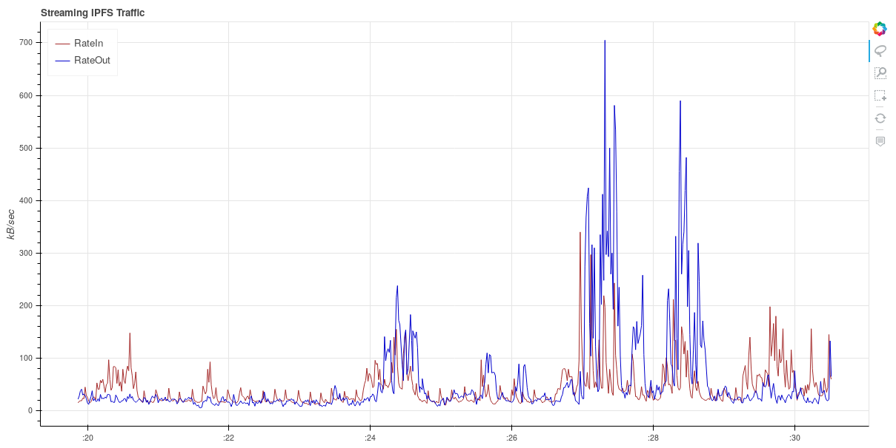

# IPFS traffic watcher

IPFS is high bandwidth demanding.

Here is just a small project to get and visualize the traffic data from ipfs daemon.

You can:

- Visualize, using `bokeh serve micro_server` and go to the specific IP (default is `http://localhost:5006/micro_server`)
- Store into db the values for analytics later `python3 memorize`

Needed:

- `python3`
- `bokeh` (`pip3 install bokeh --user`)
- `ipfs` installed, check [GitHub](https://github.com/ipfs/ipfs)
- `ìpfs daemon` running

# TODOs

- Put Argparse for command line configuration of the scripts
- Better [color](https://bokeh.pydata.org/en/latest/docs/reference/colors.html) / tools on Bokeh plots
- Merge the two scripts, for monitoring visually and storing at the same
- Compare if implementation (Normal VS Go version are differents)
- Make it packaged as a service, if you want monitor continuously, even after a restart
- Whatever